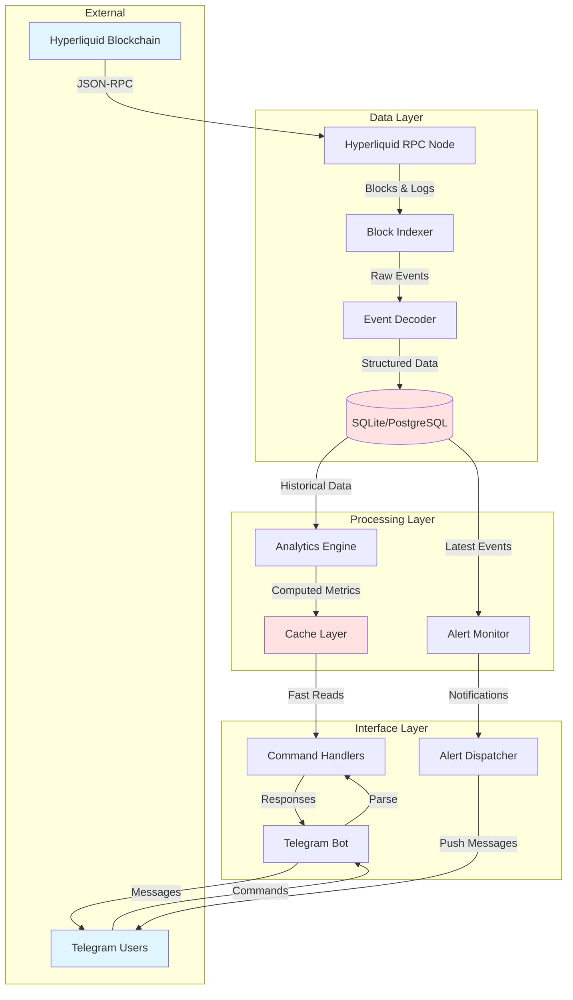

# hyperpulse - Hyperliquid Data Bot

## Project Overview

This project is designed to teach you the fundamentals of blockchain development through building a practical, real-world application: a Telegram bot that provides analytics and insights for the Hyperliquid perpetual futures protocol.

By the end of this internship, you'll have built a production-ready data analytics bot that reads on-chain trading data, indexes it efficiently, and serves it through an intuitive Telegram interface. More importantly, you'll understand how blockchains work at a fundamental level and how to build applications on top of them.

## What You'll Build

A Telegram bot that allows users to query Hyperliquid trading data through simple commands:

- Real-time trading volume analysis across different assets
- Liquidation tracking and alerts for large liquidation events
- Trader performance metrics and position history
- Whale watching (tracking large position movements)
- Market statistics and trend visualization
- Customizable alerts for significant market events

## Why This Project?

Traditional blockchain tutorials focus on theory or simple token transfers. This project is different because:

1. **Real Protocol Integration**: You'll work with Hyperliquid, a live perpetual futures DEX, learning how real DeFi protocols operate
2. **Practical Data Engineering**: You'll solve actual problems around indexing, storing, and querying blockchain data efficiently
3. **User-Facing Application**: Building a Telegram bot teaches you how to make blockchain data accessible to non-technical users
4. **Production-Ready Code**: You'll learn deployment, monitoring, error handling, and other professional development practices

## Architecture Overview



## System Components Explained

### 1. Data Layer: Understanding the Blockchain

**The Challenge**: Blockchains are append-only databases organized in blocks. Each block contains transactions, and transactions emit events (logs) that describe what happened. Your first task is to efficiently read this data.

**Components**:
- **RPC Connection**: Your gateway to the blockchain. Think of it as an API that lets you query blocks, transactions, and contract state
- **Block Indexer**: Continuously scans new blocks as they're produced (~1 block per second on Hyperliquid)
- **Event Decoder**: Translates raw blockchain logs into structured data you can work with
- **Database**: Stores decoded events for fast querying (blockchain queries are slow!)

**Key Concept**: You can't query a blockchain like "show me all trades by this user." You must index the data yourself by scanning blocks and storing events in your own database.

### 2. Processing Layer: Making Data Useful

**The Challenge**: Raw blockchain data is messy. A "trade" might be represented across multiple events. Calculating something like "24h volume" requires aggregating thousands of records.

**Components**:
- **Analytics Engine**: Transforms raw events into meaningful metrics (volume, PnL, liquidation totals)
- **Cache Layer**: Stores frequently accessed data to avoid recalculating
- **Alert Monitor**: Watches for significant events and triggers notifications

**Key Concept**: Separate data collection from data analysis. Your indexer runs continuously in the background, while analytics happen on-demand when users query.

### 3. Interface Layer: User Interaction

**The Challenge**: Make complex blockchain data accessible through simple commands.

**Components**:
- **Telegram Bot**: Handles user messages and delivers responses
- **Command Handlers**: Parse user input and route to appropriate analytics functions
- **Alert Dispatcher**: Sends proactive notifications to subscribed users

**Key Concept**: Your bot is just a view layer. All the real work happens in the data and processing layers.

## First Principles Approach

### Start With: How Does Blockchain Data Work?

Before writing any code, understand these concepts:

1. **Blocks**: Containers of transactions, produced sequentially, each pointing to the previous (a "chain")
2. **Transactions**: State changes on the blockchain (transfers, contract calls)
3. **Events/Logs**: Announcements emitted by smart contracts during transaction execution
4. **Contracts**: Programs that live on the blockchain with their own state and logic

**Mental Model**: Think of a blockchain as a global computer that everyone can read from, but writing requires paying a fee (gas). Smart contracts are like APIs on this computer, and events are their notification system.

### Question Everything

As you build, constantly ask:

- **Why can't I just query the blockchain directly?** (You can, but it's slow and limited)
- **What happens if I miss a block?** (Your data will be incomplete)
- **How do I know an event is from the contract I care about?** (Filter by contract address)
- **What if the blockchain reorganizes?** (You need to handle reorgs)
- **How do I make queries fast?** (Database indexes, caching)

### Build in Layers

Don't try to build everything at once. Follow this sequence:

1. **Connect**: Just read the latest block number
2. **Read**: Fetch a single block and print its transactions
3. **Decode**: Find an event in a transaction and decode it
4. **Store**: Save decoded events to a database
5. **Query**: Write SQL to answer questions about your data
6. **Automate**: Make your indexer run continuously
7. **Interface**: Add the Telegram bot layer
8. **Polish**: Add error handling, monitoring, documentation

### Think About Edge Cases

Blockchains are hostile environments. Things that will go wrong:

- RPC connections fail or timeout
- Blocks arrive out of order (reorgs)
- Events have unexpected values (contract bugs)
- Your database fills up
- Users send malformed commands
- The chain gets congested and falls behind

**Principle**: Always assume things will fail and code defensively.

## Technical Stack

```
Python 3.10+
├── web3.py          # Blockchain interaction
├── python-telegram-bot  # Telegram interface
├── sqlalchemy       # Database ORM
├── asyncio          # Async/await for concurrent operations
├── pydantic         # Data validation
└── pytest           # Testing
```

**Why Python?** It's readable, has excellent blockchain libraries, and is fast enough for this use case. In production, you might use Go or Rust for indexers, but Python is perfect for learning.

## Project Structure

```
hyperliquid-data-bot/
├── src/
│   ├── blockchain/
│   │   ├── connection.py      # RPC client setup
│   │   ├── indexer.py         # Block scanning logic
│   │   └── decoder.py         # Event decoding
│   ├── database/
│   │   ├── models.py          # SQLAlchemy models
│   │   ├── queries.py         # Common queries
│   │   └── migrations/        # Schema changes
│   ├── analytics/
│   │   ├── volume.py          # Volume calculations
│   │   ├── positions.py       # Position tracking
│   │   └── liquidations.py    # Liquidation analysis
│   ├── bot/
│   │   ├── handlers.py        # Command handlers
│   │   ├── alerts.py          # Alert system
│   │   └── formatters.py      # Message formatting
│   └── config.py              # Configuration management
├── tests/
│   ├── test_indexer.py
│   ├── test_analytics.py
│   └── test_bot.py
├── scripts/
│   ├── setup_db.py            # Initialize database
│   └── backfill.py            # Index historical data
├── .env.example               # Environment variables template
├── requirements.txt           # Python dependencies
├── README.md                  # This file
└── docker-compose.yml         # Local development setup
```

## Getting Started

### Prerequisites

- Python 3.10 or higher
- Basic understanding of Python (functions, classes, async/await)
- A Telegram account
- Curiosity and patience

### Initial Setup

1. **Clone and Environment Setup**
```bash
git clone <repository-url>
cd hyperliquid-data-bot
python -m venv venv
source venv/bin/activate  # On Windows: venv\Scripts\activate
pip install -r requirements.txt
```

2. **Configure Environment**
```bash
cp .env.example .env
# Edit .env with your settings (we'll get these as we go)
```

3. **Initialize Database**
```bash
python scripts/setup_db.py
```

### Development Workflow

Your development will happen in phases:

**Phase 1: Blockchain Connection (Week 1)**
- Goal: Successfully connect to Hyperliquid and read basic data
- Milestone: Script that prints latest block information

**Phase 2: Event Indexing (Week 1-2)**
- Goal: Decode and store trading events in database
- Milestone: Database contains 1000 blocks of trading data

**Phase 3: Analytics (Week 2)**
- Goal: Calculate meaningful metrics from indexed data
- Milestone: Script that outputs 24h volume by asset

**Phase 4: Telegram Bot (Week 3)**
- Goal: Serve analytics through Telegram commands
- Milestone: Working `/volume` command

**Phase 5: Advanced Features (Week 3-4)**
- Goal: Add alerts, charts, and polish
- Milestone: Production-ready bot

## Learning Resources

### Blockchain Fundamentals
- **Ethereum Whitepaper**: Understand the core concepts (skip the math)
- **web3.py Documentation**: Your primary reference for blockchain interaction
- **Etherscan**: Block explorer to visually see what you're querying

### Hyperliquid Specific
- **Hyperliquid Docs**: Protocol mechanics and contract addresses
- **Hyperliquid Explorer**: See live trading data
- **Contract ABIs**: Available in the docs, needed for decoding events

### Python Tools
- **asyncio Tutorial**: You'll need async/await for concurrent operations
- **SQLAlchemy Docs**: Database ORM patterns
- **python-telegram-bot Examples**: Telegram bot patterns

## Key Concepts to Master

### 1. Event-Driven Architecture

Blockchains are event-driven systems. Instead of constantly asking "did something happen?", you listen for events and react to them.

**Pattern**:
```python
# Bad: Polling
while True:
    if something_happened():
        react()
    sleep(1)

# Good: Event-driven
on_event('TradeExecuted', callback=process_trade)
```

### 2. Data Consistency

Your indexed data must match the blockchain state. If you miss a block or decode an event incorrectly, your analytics will be wrong.

**Validation Strategy**:
- Always check the previous block hash (detect reorgs)
- Validate event structure matches expected schema
- Compare your totals with known aggregates periodically

### 3. Async Operations

Blockchain queries are I/O-bound (waiting for network responses). Use asyncio to handle multiple operations concurrently without blocking.

**Mental Model**: 
- Sync code: Do task A, wait, do task B, wait, do task C
- Async code: Start A, B, and C together, wait for all to complete

### 4. Database Design for Time-Series Data

Trading data is time-series data. Your queries will often be "give me all X between time T1 and T2."

**Optimization**:
- Index on timestamp fields
- Partition large tables by date
- Use appropriate data types (DECIMAL for prices, not FLOAT)

## Troubleshooting Guide

### Common Issues and Solutions

**"RPC connection failed"**
- Check your RPC URL is correct
- Verify network connectivity
- Some RPCs have rate limits - add delays between requests

**"Event decoding failed"**
- Ensure you have the correct ABI
- Verify the event signature matches
- Check the contract address is correct

**"Database is slow"**
- Add indexes on frequently queried fields
- Use EXPLAIN to analyze query performance
- Consider pagination for large result sets

**"Bot doesn't respond"**
- Check bot token is correct
- Verify bot has permission to send messages
- Look at bot logs for errors

## Success Metrics

By the end of this project, you should be able to:

- [ ] Explain how blockchain data is structured (blocks, transactions, events)
- [ ] Write code that queries blockchain state and history
- [ ] Decode smart contract events into structured data
- [ ] Design a database schema for time-series blockchain data
- [ ] Build an efficient indexing system that stays in sync with the chain
- [ ] Implement complex analytics queries (aggregations, joins, time windows)
- [ ] Create a user-friendly interface for blockchain data
- [ ] Deploy and monitor a production application
- [ ] Debug issues using block explorers and logs
- [ ] Understand gas, transactions, and EVM execution

## Next Steps After Completion

Once you've built this bot, you'll have the foundation to:

1. **Build Other Indexers**: Apply these patterns to any EVM protocol
2. **Create Trading Bots**: Add execution logic (buy/sell based on your data)
3. **Build DeFi Dashboards**: Web frontends using your indexed data
4. **Contribute to Web3 Projects**: Many projects need data infrastructure
5. **Audit Smart Contracts**: Understanding events helps spot issues

## Getting Help

As you work through this project:

1. **Read Error Messages Carefully**: They usually tell you exactly what's wrong
2. **Use Print Debugging**: Add logging liberally to understand data flow
3. **Check Block Explorers**: Visually verify what you're trying to query
4. **Test with Small Ranges**: Don't try to index 10,000 blocks on your first try
5. **Ask Questions**: Document what you tried and what happened

## Philosophy

This isn't just about building a bot - it's about understanding how decentralized systems work from first principles. Every abstraction you use (web3.py, databases, Telegram) is hiding complexity. When things break, you need to understand what's happening underneath.

**Approach this project with curiosity**: Why does it work this way? What are the tradeoffs? How would I build it differently?

The best blockchain developers aren't the ones who can use the most libraries - they're the ones who understand the fundamentals deeply enough to know when to use which tool.

Good luck! 🚀

---

## Appendix: Environment Variables

Create a `.env` file with these variables:

```bash
# Hyperliquid Connection
HYPERLIQUID_RPC_URL=https://api.hyperliquid.xyz/evm

# Database
DATABASE_URL=sqlite:///hyperliquid_data.db

# Telegram Bot
TELEGRAM_BOT_TOKEN=your_bot_token_here
TELEGRAM_ADMIN_CHAT_ID=your_chat_id_here

# Indexer Settings
START_BLOCK=0  # Block to start indexing from
BLOCKS_PER_BATCH=100  # Blocks to process per iteration

# Monitoring
LOG_LEVEL=INFO
SENTRY_DSN=  # Optional: for error tracking
```

## Appendix: Useful Commands

```bash
# Run the indexer
python -m src.blockchain.indexer

# Start the Telegram bot
python -m src.bot.main

# Backfill historical data
python scripts/backfill.py --start-block 1000000 --end-block 1001000

# Run tests
pytest tests/

# Check database stats
python scripts/db_stats.py
```
